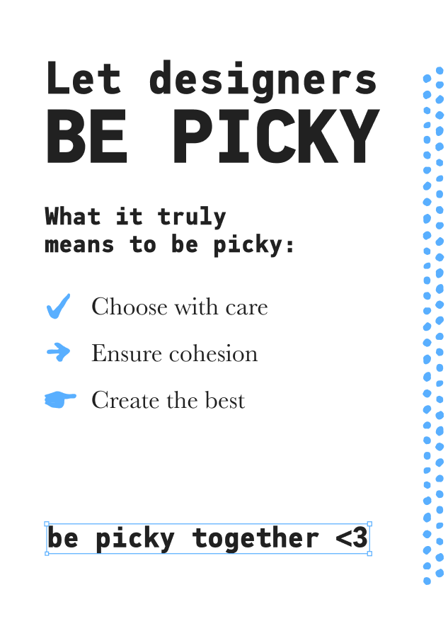

# Psst, you can empower the designers on your team
Tips from a frontend developer to another.

This zine is based on the article [How Frontend Developers Can Empower Designer’s Work](https://www.smashingmagazine.com/2019/10/frontend-developers-empower-designers-work/) that I wrote for Smashing Magazine a few months ago. At the bottom, you can check the written version but for now check out the illustrative version! Feel free to [download the printable version](./print.png).

### Digital Version

### Written Version

## Look beyond your code editor
Remember these design principles when implementing user interfaces:
- Hierarchy
- Alignment
- Spacing
- Contract

## Teach them code, not how to code.
Show to designers the joy of tweaking visuall stuff in the browser.

### Dev Tools
Refine layouts, fonts, spacings and animations.

### Code Playgrounds
Explore and tweak on [Codepen](codepen.io/) or [Glitch](glitch.com/)

## Include each other in the process
Ask designers to include you in their design process and include them in the development process as well.

You'll discover they do much more than _"make things pretty"_.

They'll better understand the web constraints and why a feature takes time to implement.

## Have doubts about the design specs? Ask First!
Do not let assumptions turn into bad decisions. You’ll be risking the trust the designers put on you.

Whenever in doubt, reach out and clarify the specs. This will show designers that **you care as much as they do.**

## Don’t make workarounds by yourself
When a designer asks you to implement a tricky design, don’t say _“It’s impossible”_ nor try to implement a cheap version of it.

Explain to them, in simple terms, the constraints and be open to collaborating on a new solution.

## Go off-the-record once in a while
We all have tasks to deliver and roadmaps to finish. However,
some of the best work happens off-the-record.

Go sneak into their workspace and explore new things. You never know what can come from there!

## Let designers be picky
What it truly means to be picky:

- Choose with care
- Ensure cohesion
- Create the best

**be picky together <3**

---

Thank you for reading!
