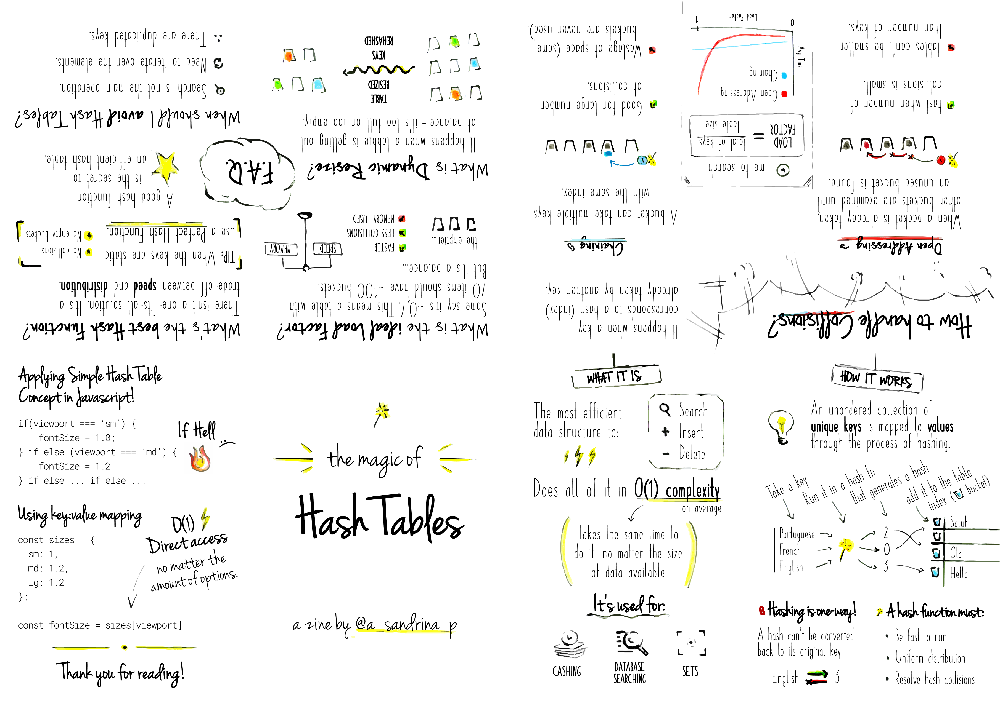
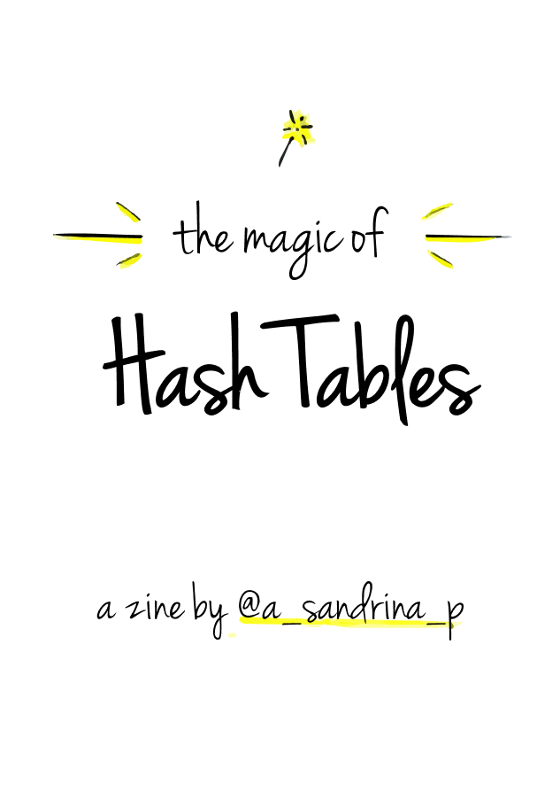
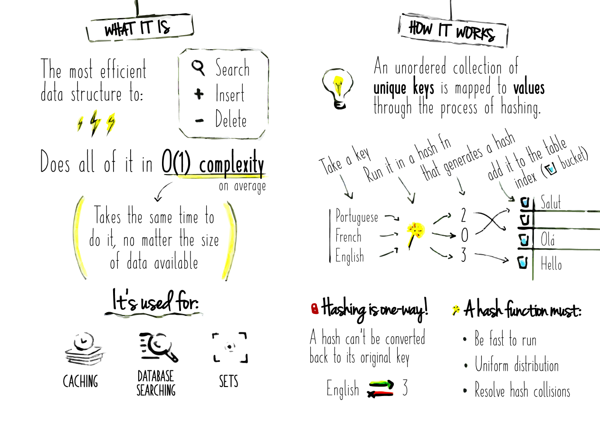
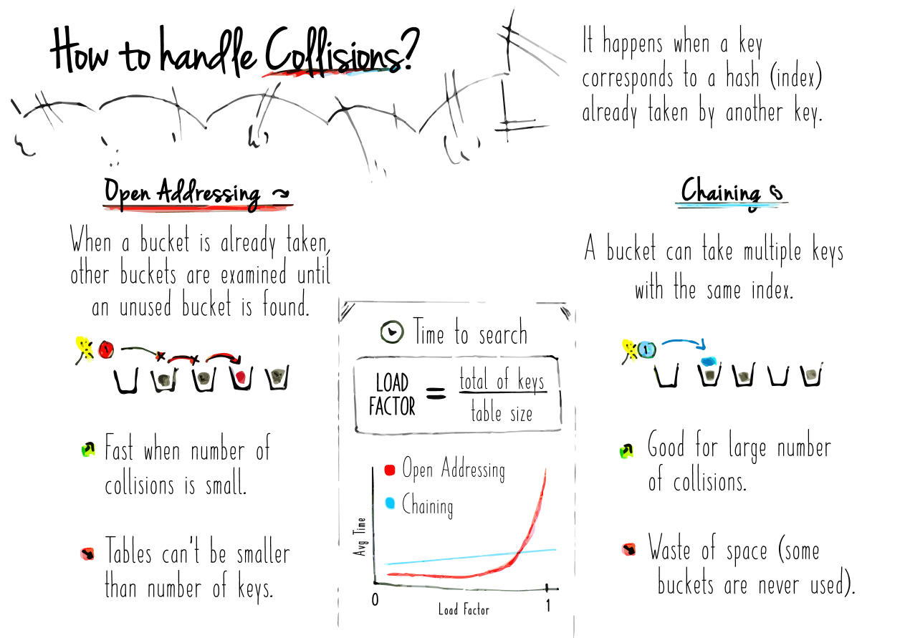
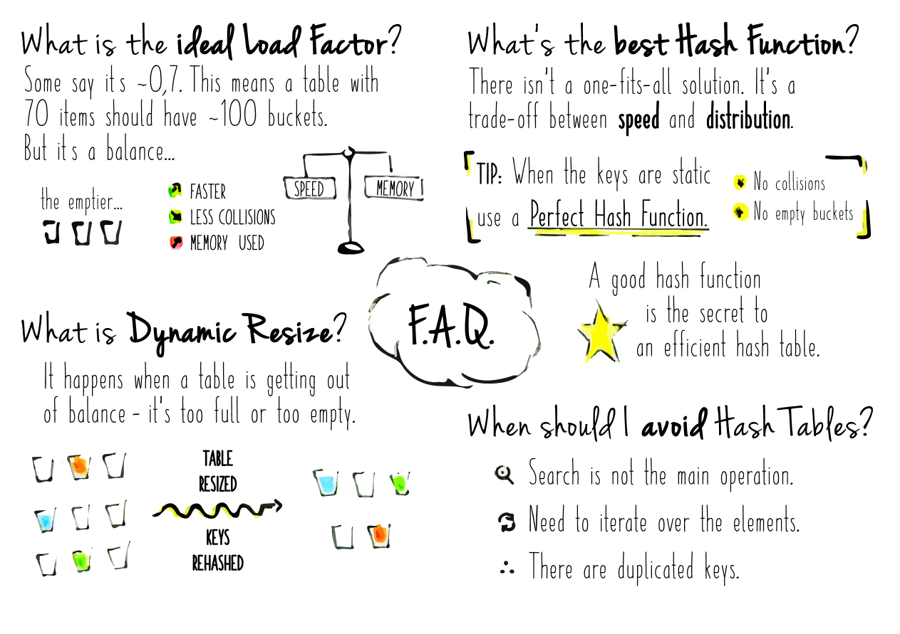
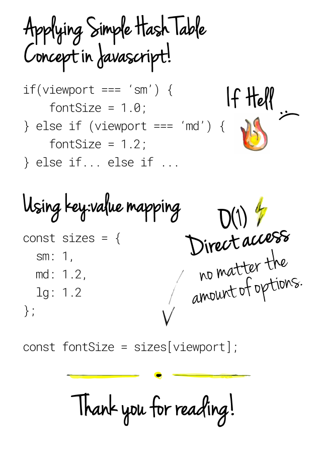

# ✨The magic of Hash Tables✨

Feel free to [download the printable version](./print.png). Here's also the [original handmade version](./original.jpg).



## Digital Version











## Written Version

### What it is
The most efficient data structure to:
- Search
- Insert
- Delete

Does all of it in O(1) complexity on average (i.e. Takes the same time to
 do it, no matter the size of data available)

####  It's used for
- Caching
- Database searching
- Sets

### How it works
An unordered collection of **unique keys** is mapped to **values** through the process of hashing.

| Take a key | Run it in a hash fn | that generates a hash |
| ---------- | ------------------- | --------------------- |
| Portuguese | ✨                  | 2                     |
| French     | ✨                  | 0                     |
| English    | ✨                  | 3                     |

... and add it to the table index (bucket):

| hash | value |
| ---- | ----- |
| 0    | Salut |
| 1    |       |
| 2    | Olá   |
| 3    | Hello |

#### Hashing is one-way!
A hash can’t be converted back to its original key.

#### A hash function must:
- Be fast to run.
- Uniform distribution.
- Resolve hash collisions.

### How to handle Collisions?
It happens when a key corresponds to a hash (index) already taken by another key.

#### Open Addressing
When a bucket is already taken,
other buckets are examined until an unused bucket is found.

- 💚 Fast when number of collisions is small.
- 🚨 Tables can’t be smaller than number of keys.

#### Chaining
A bucket can take multiple keys with the same index.

- 💚 Good for large number of collisions.
- 🚨 Waste of space (some buckets are never used).

### FAQ

#### What is the ideal Load Factor?
Some say it’s ~0.7. This means a table with 70 items should have ~100 buckets. But it’s a balance...

The emptier the buckets... faster, less collisions but more memory used.

#### What is Dynamic Resize?
It happens when a table is getting out of balance - it’s too full or too empty. It resizes the table and rehash the keys.

#### What’s the best Hash Function?
There isn’t a one-fits-all solution. It’s a trade-off between speed and distribution.

**TIP:** When the keys are static use a Perfect Hash Function. * No collisions * No empty buckets *

A good hash function is the secret to an efficient hash table.

#### When should I avoid Hash Tables?
- Search is not the main operation.
- Need to iterate over the elements.
- There are duplicated keys.

### Applying Simple Hash Table Concept in Javascript!

#### 😰If hell
```js
if(viewport === 'sm') {
    fontSize = 1.0;
} if else (viewport === 'md') {
    fontSize = 1.2;

} // if else ... if else ...

```

#### ⚡️Using key:value mapping
O(1) - Direct access - no matter the amount of options.

```js
const sizes = {

    sm: 1,
    md: 1.2,
    lg: 1.2

};

const fontSize = sizes[viewport];
```

---

Thank you for reading!
